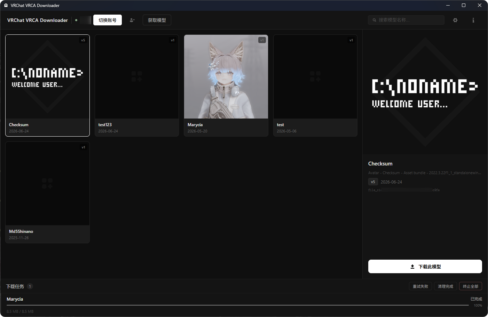

> # 严禁将本工具用于任何恶意用途。
> **本工具旨在帮助你找回属于自己的模型资产，请勿用于窃取他人资产。**

> ## 版本说明
> 当前仓库为基于 **Rust + Tauri** 的重制版本。  
> 旧版本代码已保留在 [`legacy`](../../tree/legacy) 分支中，仅用于历史参考与维护。

# VRChat VRCA Downloader

**VRChat VRCA Downloader** 是用于下载本人 VRChat 账号下 Avatar `.vrca` 文件的桌面工具。  
通过 VRChat 官方 API 获取模型列表，账号凭据仅在本地加密存储，不上传至任何第三方。

<p align="center">
  
</p>

## 功能一览

**账号**
- 用户名 / 邮箱 + 密码登录，支持 TOTP 和邮箱两种 2FA 验证
- 登录状态本地持久化，下次启动自动恢复（30 天有效期）
- 一键退出登录并清除本地凭据

**模型列表**
- 一键同步账号下全部 Avatar
- 实时搜索过滤
- 卡片缩略图 + 右侧大图预览，图片本地磁盘缓存

**下载**
- 多任务并发下载，实时速度与进度显示
- 自定义文件名模板，支持变量：`{short_name}` `{name}` `{version}` `{id}` `{date}`
- 智能超时检测（无进度自动终止）
- 失败 / 超时 / 终止任务一键重试
- 终止单个任务 / 终止全部 / 清理已完成

**网络与配置**
- 支持 HTTP / HTTPS 代理，配置持久化
- 文件名模板持久化


## 下载 & 运行

前往 [Releases](../../releases) 页面下载最新版本：

| 文件 | 说明 |
|---|---|
| `VRChat VRCA Downloader_x.x.x_x64-setup.exe` | NSIS 安装包，一键安装 |
| `vrchat-vrca-downloader.exe` | 免安装单文件，双击直接运行 |

**系统要求**：Windows 10 1803+ 或 Windows 11，需要 [WebView2 Runtime](https://developer.microsoft.com/microsoft-edge/webview2/)（Windows 11 及较新的 Windows 10 系统已自带）。


## 使用方法

1. 启动程序，点击顶栏 **登录账号**
2. 输入 VRChat 用户名（或邮箱）和密码，如有 2FA 按提示输入验证码
3. 点击 **获取模型** 等待同步模型列表
4. 点击卡片选中模型，在右侧详情面板点击 **下载此模型**，或悬停在卡片上点击下载图标
5. 在底部任务栏查看进度，可终止、重试或清理任务


## 反馈 & 交流群

- `1047423396`


## 本地开发

**依赖环境**

- [Node.js](https://nodejs.org/) 18+
- [Rust](https://rustup.rs/) stable
- [Tauri CLI](https://tauri.app/start/prerequisites/)

```bash
# 克隆仓库
git clone https://github.com/Null-K/VRChatVRCADownloader.git
cd VRChatVRCADownloader

# 安装前端依赖
npm install

# 启动开发模式
npm run tauri dev

# 构建发布版本
npm run tauri build
```

构建产物位于：`src-tauri/target/release/bundle/`


## 免责声明

本工具为第三方辅助工具，**仅用于个人账号的模型资产管理与下载**。

- 所有数据请求均通过 VRChat 官方公开 API 完成
- 不包含对 VRChat 客户端、服务器或资源的任何注入或篡改
- 不存储、不上传、不分享用户账号密码或凭据至任何第三方
- 不提供也不支持任何绕过权限或非法访问的行为

**使用本工具产生的一切后果由使用者自行承担。**
